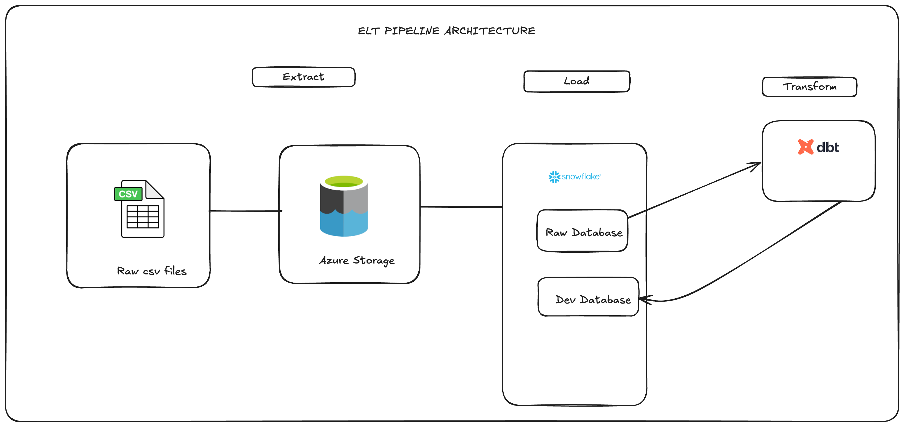

````markdown
# Welcome to Netflix ELT Pipeline using Azure Storage, Snowflake, and dbt
```
This project demonstrates an end-to-end ELT (Extract, Load, Transform) pipeline using Azure Storage for raw data ingestion, Snowflake as the cloud data warehouse, and dbt for data transformations and data modeling.


### 🗂️ Resources

- For datasets, please visit [MovieLens](https://grouplens.org/datasets/movielens/20m/)

---

### 🏗️ Architecture Diagram

Below is the high-level architecture of the pipeline:



> **Note**: Replace the above path with your actual diagram location inside the repo (`/assets/architecture-diagram.png`).  
> If you want a hand-drawn style or tool recommendation, I can help generate or suggest one.

---

### ⚙️ Key dbt Commands

Run these commands from your dbt project root folder:

#### 🔨 Build Models
```bash
dbt build
````

#### 🏗️ Run Specific Models

```bash
dbt run --select model_name
```

#### 🧪 Run Tests

```bash
dbt test
```

#### 📄 Generate Documentation

```bash
dbt docs generate
```

#### 🌐 Serve Documentation Locally

```bash
dbt docs serve
```

#### 📊 Run Analysis Queries

```bash
dbt compile --select path:analyses/
```


